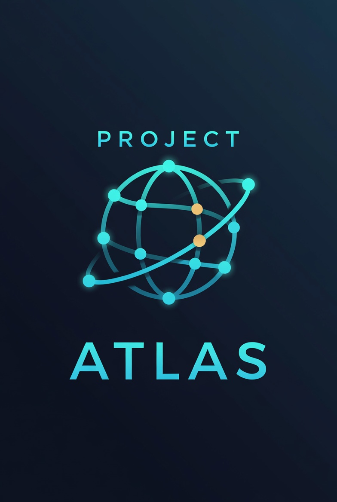

# Project Atlas



**Advanced Trading & Liquidity Analysis System**

Institutional-style market intelligence for Hyperliquid perpetual markets and high-quality equity dip monitoring.


---

## What it does

- Continuously scans Hyperliquid perps for abnormal movement
- Tracks opportunities with confidence, regime, and risk context
- 24h paper funnel (`/diagnostics`, `/research`) — bottleneck diagnosis without retuning gates
- Optional paper-trade performance tracking
- Discord DM alerts (subscribe-only, no channel spam)
- Quality Dip scanner for large-cap names (ADBE, META, GOOGL, AMZN, MSFT)
- FastAPI backend + optional Next.js frontend dashboard

This is an **alert and analysis system**. It does not auto-trade.

---

<!--
### Dashboard


### Opportunities


### Discord alert


### Quality dips


### Health

-->

---

## Stack

- Python 3.12, FastAPI, asyncio
- PostgreSQL / TimescaleDB, Redis
- Discord.py
- yfinance (equity dips)
- Next.js frontend (optional)
- Docker Compose for local infra

---

## Quick start (Windows)

**One desktop shortcut.** It starts Docker, the API, and the frontend dashboard,
then opens your browser. Close that window to stop everything (including Docker Desktop).

Full copy-from-GitHub steps: [`docs/WINDOWS.md`](docs/WINDOWS.md)

```powershell
git clone https://github.com/LeakPilotAI/project-atlas.git "D:\Work\Project Atlas"
cd "D:\Work\Project Atlas"
# restore backend\.env from your backup first
powershell -ExecutionPolicy Bypass -File scripts\windows\Fresh-Setup.ps1
```

Then double-click **Project Atlas** on the desktop.

Do not use separate Start / Stop icons. Dashboard: http://127.0.0.1:3000
